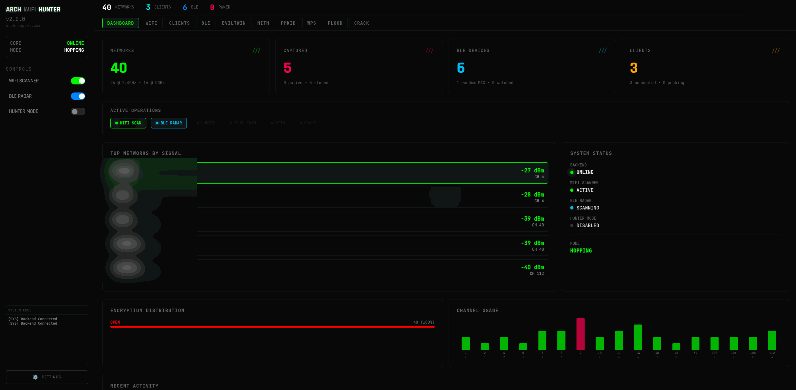

# ARCH WIFI HUNTER

**WiFi & BLE Security Testing and Intelligence Platform. Built for Kali Linux.**

[archrampart.com](https://www.archrampart.com)



## Modules

| Module | Description |
|--------|-------------|
| **WIFI** | Dual-band scanning, deauth, handshake capture, client monitoring |
| **BLE** | Device discovery, GATT inspection, 7-attack suite (see below) |
| **EVILTWIN** | Rogue AP — Captive Portal or Internet Relay mode |
| **MITM** | Packet sniffer, credential capture, DNS spoofing, PCAP export |
| **PROBE ANALYZER** | Client intelligence — SSID profiling, shared networks, nearby match, vulnerable client detection |
| **PMKID** | Clientless PMKID hash capture via hcxdumptool |
| **WPS** | Pixie Dust & PIN attacks via reaver/pixiewps |
| **FLOOD** | Beacon flood attack via mdk4 |
| **CRACK** | Unified password cracking (handshake + PMKID) via aircrack-ng |
| **HUNTER MODE** | Automated target selection, handshake capture, and rotation |

### Evil Twin Modes

| Mode | Description |
|------|-------------|
| **Captive Portal** | Fake login page (WiFi Login / Router Update) for credential harvesting. Kills NetworkManager, redirects all traffic to portal. |
| **Internet Relay** | Clients get real internet via NAT masquerade. Preserves host connectivity. Enables MITM packet capture on live traffic. Custom SSID or clone target network. |

### MITM Suite

| Feature | Description |
|---------|-------------|
| **Packet Sniffer** | Real-time DNS query, HTTP request, and credential capture via scapy |
| **Credential Detection** | Automatic POST body inspection for passwords, tokens, auth data |
| **DNS Spoofing** | Live dnsmasq config injection with domain-to-IP mapping |
| **PCAP Export** | Download captured packets as .pcap file for Wireshark analysis |

### Probe Analyzer

| Panel | Description |
|-------|-------------|
| **Most Probed SSIDs** | Ranked list of SSIDs most searched by nearby clients, with bar chart visualization |
| **Shared Networks** | SSIDs probed by 2+ clients — indicates devices from the same location or organization |
| **Nearby Matches** | Probed SSIDs that match real active APs nearby — ideal Evil Twin targets (auto-connect) |
| **Vulnerable Clients** | Devices probing common/default SSIDs (linksys, FreeWifi, Guest, etc.) — Karma attack targets |
| **Client Profiles** | Per-device probe summary with color-coded SSIDs (green=nearby, red=vulnerable), RSSI, connection status |

### BLE Attack Suite

| Attack | Description |
|--------|-------------|
| **Auto-Connect** | Service enumeration, vulnerability detection (17 known services), writable characteristic probing |
| **PIN Brute-Force** | 3-phase analysis: pairing type detection, characteristic probing, 51-PIN dictionary |
| **Fuzzing** | Payload fuzzing with crash detection, 15 fuzz patterns, auto-reconnect on disconnect |
| **Command Injection** | 20 injection payloads, notify subscription, response pattern matching |
| **Hijacking** | Continuous connection monitoring with live notification tracking |
| **Battery Drain** | Multi-phase drain (rapid connect/disconnect, GATT flood, max MTU request) with live stats |
| **Beacon Spoof** | HCI-level beacon transmission with 4 sub-modes: iBeacon, Eddystone-URL, Name Clone, BLE Flood |

## Requirements

- **Kali Linux**
- **Python 3.10+**
- **Node.js 18+**
- **WiFi adapter** (monitor mode + AP mode capable, e.g. Alfa AWUS036ACH)
- **Bluetooth adapter** (for BLE attacks)
- Root privileges

### Dual-Adapter Setup (recommended for Evil Twin + MITM)

For Internet Relay mode, two wireless interfaces are needed:

| Interface | Role | Example |
|-----------|------|---------|
| wlan0 | Host internet (managed by NetworkManager) | Internal WiFi / USB adapter |
| wlan1 | Rogue AP (hostapd) + MITM sniffing | USB pentest adapter |

The system auto-detects which interface carries the default route and uses the other for the rogue AP.

## Install

### Quick (recommended)

```bash
sudo ./setup.sh
```

This will check/install system tools, create Python venv, install dependencies, and build the frontend.

### Manual

```bash
# 1. System tools
sudo apt update
sudo apt install -y aircrack-ng mdk4 hcxdumptool hcxtools reaver pixiewps \
                    nmap hostapd dnsmasq iptables python3-venv python3-pip

# 2. Backend
cd backend
python3 -m venv venv
source venv/bin/activate
pip install --upgrade pip
pip install -r requirements.txt
deactivate
cd ..

# 3. Frontend
cd frontend
npm install
npm run build
cd ..

# 4. Create directories
mkdir -p backend/captures backend/exports wordlists
```

### System Tools Reference

| Tool | Package | Used By |
|------|---------|---------|
| aircrack-ng | aircrack-ng | WiFi, Crack, Hunter Mode |
| mdk4 | mdk4 | Beacon Flood |
| hcxdumptool | hcxdumptool | PMKID capture |
| hcxpcapngtool | hcxtools | PMKID conversion |
| reaver | reaver | WPS attacks |
| pixiewps | pixiewps | WPS Pixie Dust |
| nmap | nmap | Network scanning |
| hostapd | hostapd | Evil Twin AP |
| dnsmasq | dnsmasq | Evil Twin DHCP/DNS |
| iptables | iptables | Evil Twin routing / NAT |
| nmcli | network-manager | Interface management |
| scapy | python (pip) | MITM packet capture |

## Usage

### Quick

```bash
sudo ./start.sh
```

### Manual

```bash
# Terminal 1: Frontend
cd frontend
npm run dev

# Terminal 2: BLE Agent
sudo backend/venv/bin/python backend/ble_agent.py

# Terminal 3: Backend API
sudo backend/venv/bin/uvicorn backend.main:app --host 0.0.0.0 --port 8000
```

- **Frontend**: http://localhost:5173
- **API**: http://localhost:8000
- **Docs**: http://localhost:8000/docs

## Legal

**Authorized use only.** This tool is for penetration testing with explicit permission, security research, and CTF competitions. Unauthorized network access is illegal.

## License

[MIT](LICENSE)
